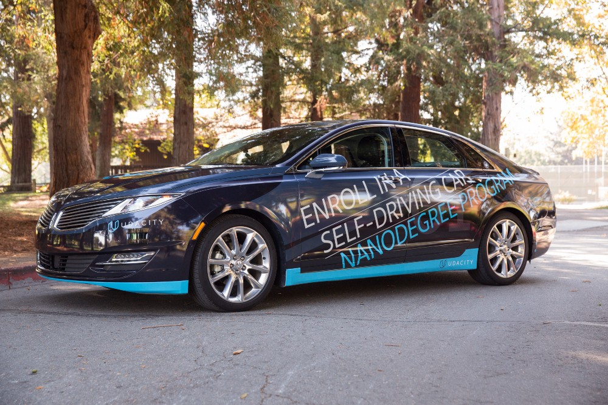

# [Udacity Self Driving Car Nanodegree](https://www.udacity.com/drive)

This repository contains all the projects I have completed for the [Self Driving Car Nanodegree](https://www.udacity.com/drive) offered by [Udacity](https://www.udacity.com). There are over 11,000 people applied for this Nanodegree progam and I was selected as one of the 500 students for the very first cohort started in October 2016. The [curriculum](https://medium.com/self-driving-cars/term-1-in-depth-on-udacitys-self-driving-car-curriculum-ffcf46af0c08#.nglkprlow) of this program consists of three terms over nine months. This repository will be updated with my progress accordingly. 

## Term 1:  Computer Vision and Deep Learning

  #  | Title           |  Solution       | Techniques      | Libraries      | Dataset  
-----|---------------- | --------------- | --------------- | ---------------| ---------------
1 | [Finding Lane Lines](P1_Find_Lane_Lines/) | [Python](P1_Find_Lane_Lines/P1.ipynb) | [Color Space Conversion](http://docs.opencv.org/3.1.0/de/d25/imgproc_color_conversions.html), [Canny Edge Detection](http://docs.opencv.org/trunk/da/d22/tutorial_py_canny.html), [Hough Transformation](http://docs.opencv.org/2.4/doc/tutorials/imgproc/imgtrans/hough_lines/hough_lines.html) | [OpenCV](http://opencv.org/), [MoviePy](http://zulko.github.io/moviepy/) | [Udacity](https://github.com/udacity/CarND-LaneLines-P1)
- | [TensorFlow Lab](TensorFlow_Lab/) | [Python](TensorFlow_Lab/lab.ipynb) | [Neural Network](https://en.wikipedia.org/wiki/Artificial_neural_network), [Min-Max Scaling](http://scikit-learn.org/stable/modules/generated/sklearn.preprocessing.MinMaxScaler.html) | [TensorFlow](https://www.tensorflow.org/), [Scikit-Learn](http://scikit-learn.org/), [tqdm](https://github.com/noamraph/tqdm)
2 | [Traffic Sign Classifier] (P2_Traffic_Signs/) | [Python](P2_traffic_signs/Traffic_Signs_Recognition.ipynb) | [Convolutional Neural Network](https://en.wikipedia.org/wiki/Convolutional_neural_network), [Relu](https://en.wikipedia.org/wiki/Rectifier_(neural_networks)), [Pooling](http://ufldl.stanford.edu/tutorial/supervised/Pooling/), [Dropout](https://www.cs.toronto.edu/~hinton/absps/JMLRdropout.pdf), [Regularization](https://en.wikipedia.org/wiki/Regularization_(mathematics)) | [TensorFlow](https://www.tensorflow.org/), [Scikit-Learn](http://scikit-learn.org/)
- | [Keras Lab](Keras_Lab/) | [Python](Keras_Lab/traffic-sign-classification-with-keras.ipynb) | [Keras Models](https://keras.io/models/about-keras-models/), [Keras Layers](https://keras.io/layers/about-keras-layers/) | [Keras](https://keras.io/)
- | [AlexNet Lab](AlexNet_Lab/) | [Python](AlexNet_Lab/train_feature_extraction.py) | [Transfer Learning](http://cs231n.github.io/transfer-learning/), [AlexNet](https://github.com/BVLC/caffe/tree/master/models/bvlc_alexnet) | [Tensorflow](https://www.tensorflow.org/), [Scikit-Learn](http://scikit-learn.org/)
- | [Transfer Learning Lab](Transfer_Learning_Lab/) | [Python](Transfer_Learning_Lab/feature_extraction.py) | [Transfer Learning](http://cs231n.github.io/transfer-learning/), [VGG](http://www.robots.ox.ac.uk/~vgg/research/very_deep/), [ResNet](https://github.com/KaimingHe/deep-residual-networks), [GoogLeNet](https://github.com/BVLC/caffe/tree/master/models/bvlc_googlenet) | [Tensorflow](https://www.tensorflow.org/), [Keras](https://keras.io/)
